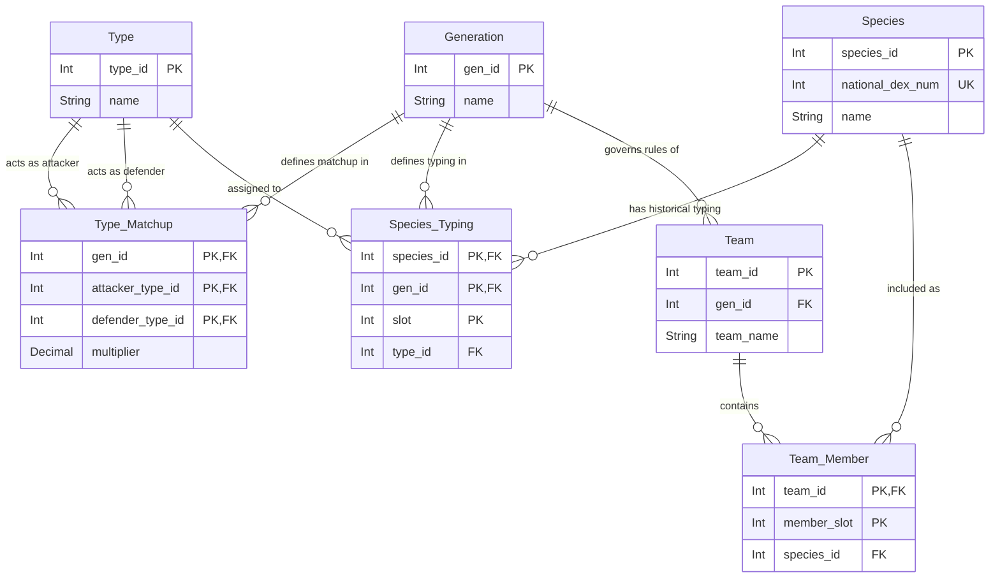

# Pokémon Battle Matchup Engine - Database Schema (Version 1)

## 1. Executive Summary

The Pokémon Battle Matchup Engine (Version 1) is a relational database designed to accurately model and resolve Pokémon battles across all franchise generations (Gen 1-9). A core architectural pillar of this engine is its **temporal/generational design**. Because Pokémon mechanics—such as species typing and type effectiveness—change between generations (e.g., the introduction of the Steel and Dark types in Gen 2, the Fairy type in Gen 6, and species typing retrofits like Clefairy becoming Fairy), the engine maps entities dimensionally against generations. This ensures historical accuracy for matchups depending on the generation in which a battle takes place.

## 2. Entity-Relationship Diagram (ERD)

## 3. Data Dictionary

### Core Dimensions

#### Table: `Generation`
| Column Name | Data Type | Key | Description |
| :--- | :--- | :--- | :--- |
| `gen_id` | Int | PK | Unique identifier for the generation. |
| `name` | String | - | Name of the generation (e.g., "Generation 1", "Generation 6"). |

#### Table: `Type`
| Column Name | Data Type | Key | Description |
| :--- | :--- | :--- | :--- |
| `type_id` | Int | PK | Unique identifier for the elemental type. |
| `name` | String | - | Name of the type (e.g., "Fire", "Water", "Fairy"). |

#### Table: `Species`
| Column Name | Data Type | Key | Description |
| :--- | :--- | :--- | :--- |
| `species_id` | Int | PK | Unique identifier for the Pokémon species. |
| `national_dex_num` | Int | Unique | National Pokédex number of the species. |
| `name` | String | - | Name of the species (e.g., "Bulbasaur", "Togepi"). |

### Generational Mappings (Resolution Grid)

#### Table: `Type_Matchup`
| Column Name | Data Type | Key | Description |
| :--- | :--- | :--- | :--- |
| `gen_id` | Int | PK, FK | References `Generation(gen_id)`. |
| `attacker_type_id` | Int | PK, FK | References `Type(type_id)`. The attacking move's type. |
| `defender_type_id` | Int | PK, FK | References `Type(type_id)`. The defending Pokémon's type. |
| `multiplier` | Decimal | - | Damage multiplier (0.0, 0.5, 1.0, 2.0). |

#### Table: `Species_Typing`
| Column Name | Data Type | Key | Description |
| :--- | :--- | :--- | :--- |
| `species_id` | Int | PK, FK | References `Species(species_id)`. |
| `gen_id` | Int | PK, FK | References `Generation(gen_id)`. |
| `slot` | Int | PK | Slot of the type (1 for Primary, 2 for Secondary). Restricted to 1 or 2. |
| `type_id` | Int | FK | References `Type(type_id)`. |

### Team & Instance Management

#### Table: `Team`
| Column Name | Data Type | Key | Description |
| :--- | :--- | :--- | :--- |
| `team_id` | Int | PK | Unique identifier for the team. |
| `gen_id` | Int | FK | References `Generation(gen_id)`. Dictates the generational ruleset for the team. |
| `team_name` | String | - | Name of the team. |

#### Table: `Team_Member`
| Column Name | Data Type | Key | Description |
| :--- | :--- | :--- | :--- |
| `team_id` | Int | PK, FK | References `Team(team_id)`. |
| `member_slot` | Int | PK | Position of the Pokémon in the team. Restricted to 1-6. |
| `species_id` | Int | FK | References `Species(species_id)`. |

## 4. Data Integrity & Constraints

- **Team Limits**: The `Team_Member` table enforces a maximum of 6 Pokémon per team by applying a constraint on `member_slot` (must be between 1 and 6). The composite primary key `(team_id, member_slot)` ensures no two members occupy the same slot in a team.
- **Species Typing Slots**: The `Species_Typing` table restricts the `slot` column to `1` or `2`, representing primary and secondary types. This ensures a Pokémon can have a maximum of two types per generation.
- **Generational Integrity**: A team's environment is scoped to a specific generation via `Team.gen_id`. When querying type effectiveness or retrieving a Pokémon's typing for a team, all joins must strictly include the `Team.gen_id` filter. This prevents illegal states, such as a Gen 3 team utilizing Gen 6 Fairy matchups or Gen 6 Fairy typings.
- **Application-Layer Weakness Calculation**: The database solely stores singular type-to-type matchups in `Type_Matchup`. Dual-type weaknesses (e.g., Water/Flying vs. Electric) are calculated dynamically at the application layer by multiplying the individual lookup results, rather than being statically persisted.

## 5. Architecture Roadmap (V2)

In Version 2 of the engine, the logical model will scale to accommodate more intricate battle mechanics:
- **Abilities**: We will introduce an interceptor table to handle Pokémon Abilities. Since Abilities can modify type matchups (e.g., *Levitate* granting immunity to Ground), the new model will support dynamic matchup modifiers bridging `Species`, `Ability`, and `Type_Matchup`.
- **Base Stats**: A new `Species_Base_Stats` table will be introduced to track stats (HP, Attack, Defense, Sp. Atk, Sp. Def, Speed). Similar to typing, base stats will be modeled generationally (keyed by `gen_id` and `species_id`) to support changes in stat distributions introduced in newer generations.
